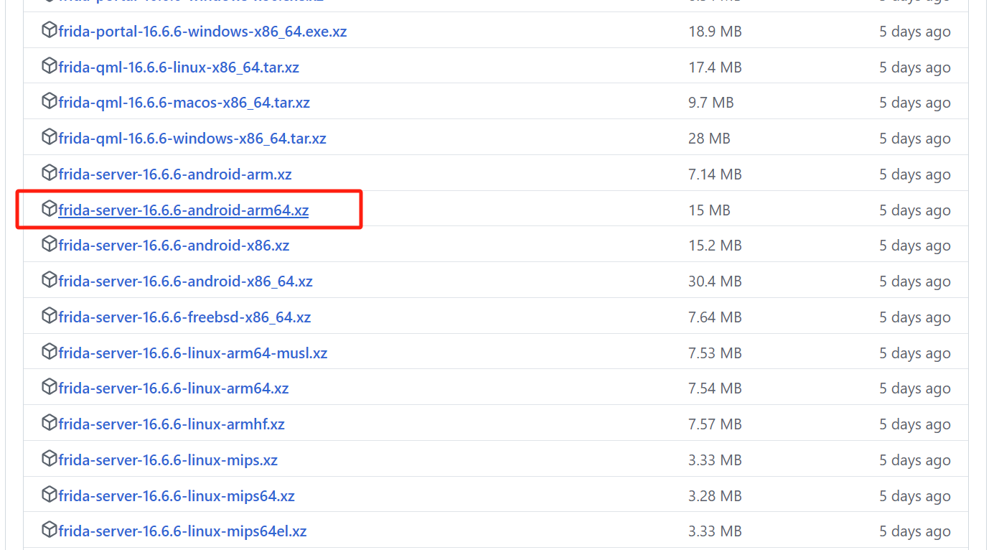

# frida简单操作

## 安装及配置

首先准备一台root过的安卓机

### pc上安装frida

有洁癖就可以先创建一个虚拟环境对吧

```shell
conda create -n revers2env python=3.8  # 创建环境
conda activate revers2env  # 切换到环境
```

根据官方文档的指示，不考虑版本，先把客户端装上再说

```she
pip install frida-tools
```

命令运行完成后用 `frida - version` 看一下frida有没有安装成功


### 手机上安装frida-server

手机上安装frida-server要和硬件匹配，那么要怎么知道手机硬件是什么呢

``````
PS D:\android-dev\platform-tools> adb shell getprop ro.product.cpu.abi
arm64-v8a  # 输出结果，那么就是arm64
``````

#### 下载frida server

查看手机型号，然后在 [下载列表](https://github.com/frida/frida/releases) 中查找匹配的包进行下载，比如我的手机是`arm64-v8a` 的，那我就下载



此刻要注意一个事情就是，这下载列表有一堆包，千万别下错了，包前缀是 `frida-server-x.x.x-andrroid-***`

#### 将frida-server推到手机里

下载完事后，就使用adb命令把frida-server的包 **push** 到设备的临时文件中

记得解压一下再往里边推

```shell
adb push E:\download\android\frida\frida-server-16.6.6-android-arm64\frida-server /data/local/tmp
```

#### 更改frida-server文件的权限

```shell
chmod 755 /data/local/tmp/frida-server
```

#### [转发端口](https://juejin.cn/post/7363078360786485287)

```she
adb forward tcp:27042 tcp:27042

// 有的文章也加上了下面这一行，我不知道原因，也没细究。先无脑跟着做吧
adb forward tcp:27043 tcp:27043s
```

> 解释：`tcp:27042` 通常是 `frida-server` 监听的默认端口。执行此命令以使 Frida 客户端连接到设备上的 `frida-server`。

#### 运行frida-server

通过adb在设备上启动 `frida-server` ，并在后台运行

```shell
# 直接在adb shell中运行
/data/local/tmp/frida-server &
# 使用adb运行(这个好像有点问题)
# Unable to load SELinux policy from the kernel: Failed to open file ?/sys/fs/selinux/policy?: Permission denied
adb shell "/data/local/tmp/frida-server &"
```

#### 验证运行

```shell
frida-ps -U
```

> 出现问题
>
> Failed to enumerate applications: unable to find process with name 'system_server'

不清楚什么情况换了根正常的线就好了


正常输出了，说明一切ok，准备工作完成