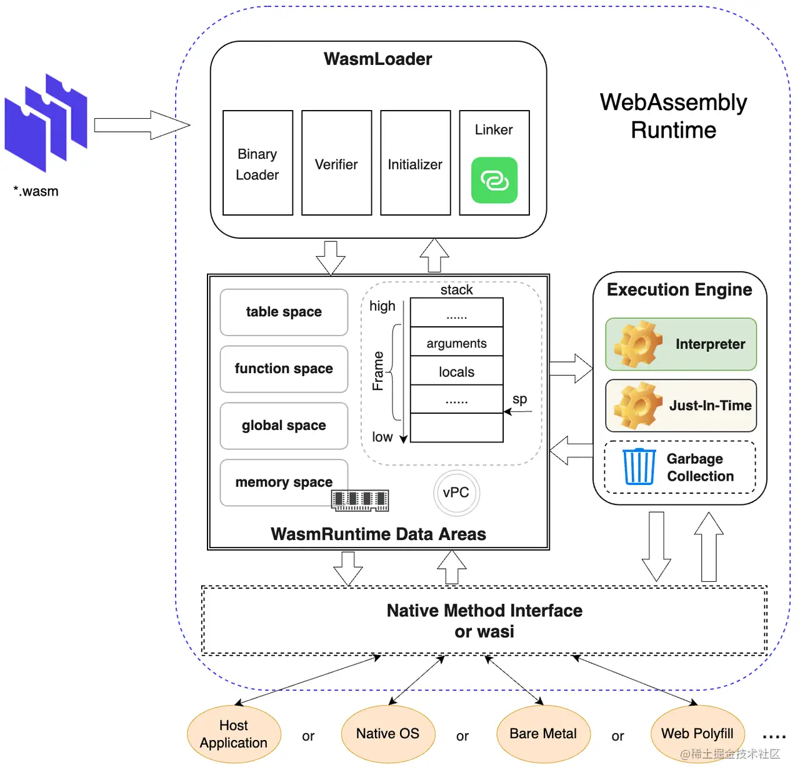

# WASM基础

## 概念

### 运行时

WebAssembly 运行时由模块加载和解析器、执行引擎以及与宿主的系统交互接口(WASI)等关键部分组成。其中，`WasmLoader` 主要完成 WebAssembly 标准二进制文件 [2]的加载、解码，格式校验，初始化和多模块的链接等多个阶段；当文件加载完成后，WebAssembly 运行时会为二进制文件生成对应的 WebAssembly 模块实例对象，并初始化运行时环境中**数据区(WasmRuntime Data Areas)**，包括**全局数据区(global space)**、**方法区(function space)**、**间接对象引用区(table space)**以及**线性内存区(memory space)**；完成以上两个阶段后，运行时会调度**执行引擎 (Execution Engine)** 来执行对应 WebAssembly 方法区中函数的字节码，不同的执行引擎会采用不同的技术来执行字节码，其中最典型的是解释执行和运行期编译执行两种类型；此外，执行引擎还需要调度内存管理器来完成内存分配，并利用垃圾回收机制进行运行期复杂对象的管理。



## 解析器

### 模块加载和解码

### 模块验证

### 实例化

## 数据结构

### 栈（Stack）

栈是一种存储数据的结构，它遵循 **后进先出（LIFO）** 的原则，即 **最后压入栈的数据会最先被弹出**。WebAssembly 使用栈来存储函数调用中的临时值。栈的使用非常直观：**每当一个函数调用时，会将需要的参数压入栈中，执行完毕后再将结果从栈中弹出**。

#### **栈的特点**

- **存储临时数据：** 在函数执行过程中，所有中间值（如计算结果）都会保存在栈中。
- **后进先出：** 栈数据的读取顺序是逆序的，即最后加入的数据会先被取出。
- **内存是自动管理的：** 每个函数调用结束后，栈上的数据会被清理，栈的空间可以被重用。

#### **栈的工作流程**

1. **压栈：** 当函数调用开始时，参数和局部变量被压入栈。
2. **执行：** 执行函数体，可能会对栈中的数据进行操作。
3. **弹栈：** 函数执行完毕后，结果从栈中返回，栈会清理临时数据。

#### **栈操作示例：**

```wasm
(func $example (param $x i32) (param $y i32) (result i32)
    local.get $x          ;; 获取 $x 的值（压入栈）
    local.get $y          ;; 获取 $y 的值（压入栈）
    i32.add               ;; 将栈顶两个值相加
)
```

在这段代码中：

- `local.get $x` 和 `local.get $y` 会将 `$x` 和 `$y` 的值压入栈中。
- `i32.add` 会从栈中弹出这两个值，执行加法操作，并将结果压回栈。

这段代码用其他语言表示

```javascript
function example(x, y) {
    return x + y
}
```


## 运算操作

### **1. 数据类型和常量操作**

- **`i32.const`**:
  加载一个 32 位有符号整数常量到栈上。
  例如：`i32.const 42` 将 `42` 放入栈中。
- **`i64.const`**:
  加载一个 64 位有符号整数常量到栈上。
- **`f32.const`**:
  加载一个 32 位浮点常量到栈上。
- **`f64.const`**:
  加载一个 64 位浮点常量到栈上。

### **2. 栈操作**

- **`local.get`**:
  从局部变量中获取值并将其推入栈中。
  例如：`local.get $var0` 将局部变量 `$var0` 的值放入栈。
- **`local.set`**:
  从栈中获取值并将其存储到局部变量中。
  例如：`local.set $var0` 将栈顶值存入局部变量 `$var0`。
- **`local.tee`**:
  将栈顶的值存储到局部变量中，并保持栈顶值不变。
  例如：`local.tee $var0` 将栈顶值存入 `$var0`，并保留栈顶值。
- **`global.get`**:
  获取全局变量的值并将其推入栈中。
- **`global.set`**:
  将栈顶的值设置为全局变量。

### **3. 算术操作**

- **`i32.add`**:
  对栈顶的两个 32 位整数进行加法运算，并将结果放回栈中。
- **`i32.sub`**:
  对栈顶的两个 32 位整数进行减法运算。
- **`i32.mul`**:
  对栈顶的两个 32 位整数进行乘法运算。
- **`i32.div_s`**:
  对栈顶的两个 32 位整数进行带符号除法运算。
- **`i32.div_u`**:
  对栈顶的两个 32 位整数进行无符号除法运算。
- **`i32.rem_s`**:
  对栈顶的两个 32 位整数进行带符号取余运算。
- **`i32.rem_u`**:
  对栈顶的两个 32 位整数进行无符号取余运算。
- **`i32.and`**:
  对栈顶的两个 32 位整数进行按位与运算。
- **`i32.or`**:
  对栈顶的两个 32 位整数进行按位或运算。
- **`i32.xor`**:
  对栈顶的两个 32 位整数进行按位异或运算。
- **`i32.shl`**:
  对栈顶的两个 32 位整数进行左移操作。
- **`i32.shr_s`**:
  对栈顶的两个 32 位整数进行带符号右移操作。
- **`i32.shr_u`**:
  对栈顶的两个 32 位整数进行无符号右移操作。
- **`i32.clz`**:
  计算栈顶 32 位整数的前导零的数量（count leading zeros）。
- **`i32.ctz`**:
  计算栈顶 32 位整数的尾随零的数量（count trailing zeros）。
- **`i32.popcnt`**:
  计算栈顶 32 位整数中 1 的个数。
- **`f32.add`**:
  对栈顶的两个 32 位浮点数进行加法运算。
- **`f32.sub`**:
  对栈顶的两个 32 位浮点数进行减法运算。
- **`f32.mul`**:
  对栈顶的两个 32 位浮点数进行乘法运算。
- **`f32.div`**:
  对栈顶的两个 32 位浮点数进行除法运算。

### **4. 比较操作**

- **`i32.eq`**:
  比较栈顶的两个 32 位整数是否相等，结果为 1（相等）或 0（不相等）。
- **`i32.ne`**:
  比较栈顶的两个 32 位整数是否不相等。
- **`i32.lt_s`**:
  比较栈顶的两个 32 位整数，判断第一个是否小于第二个（带符号比较）。
- **`i32.lt_u`**:
  比较栈顶的两个 32 位整数，判断第一个是否小于第二个（无符号比较）。
- **`i32.gt_s`**:
  比较栈顶的两个 32 位整数，判断第一个是否大于第二个（带符号比较）。
- **`i32.gt_u`**:
  比较栈顶的两个 32 位整数，判断第一个是否大于第二个（无符号比较）。
- **`i32.le_s`**:
  比较栈顶的两个 32 位整数，判断第一个是否小于或等于第二个（带符号比较）。
- **`i32.le_u`**:
  比较栈顶的两个 32 位整数，判断第一个是否小于或等于第二个（无符号比较）。
- **`i32.ge_s`**:
  比较栈顶的两个 32 位整数，判断第一个是否大于或等于第二个（带符号比较）。
- **`i32.ge_u`**:
  比较栈顶的两个 32 位整数，判断第一个是否大于或等于第二个（无符号比较）。

### **5. 控制流操作**

- **`br`**:
  无条件跳转到指定标签。
- **`br_if`**:
  如果栈顶值为非零，则跳转到指定标签。
- **`br_table`**:
  根据栈顶的整数值，从一系列标签中选择跳转目标。
- **`return`**:
  退出当前函数，并将栈上的值作为返回值返回。
- **`call`**:
  调用指定的函数，函数的参数和返回值从栈中获取。
- **`call_indirect`**:
  调用一个间接函数，函数地址存储在表中。

### **6. 内存操作**

- **`i32.load`**:
  从内存加载一个 32 位整数。
- **`i32.load8_s`**:
  从内存加载一个 8 位带符号整数。
- **`i32.load8_u`**:
  从内存加载一个 8 位无符号整数。
- **`i32.store`**:
  将栈顶的 32 位整数存储到内存。
- **`i32.store8`**:
  将栈顶的 8 位整数存储到内存。
- **`memory.size`**:
  获取当前 WebAssembly 实例的内存大小。
- **`memory.grow`**:
  增加内存大小，返回增长的页数。