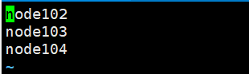
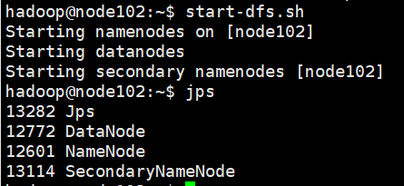
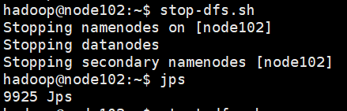
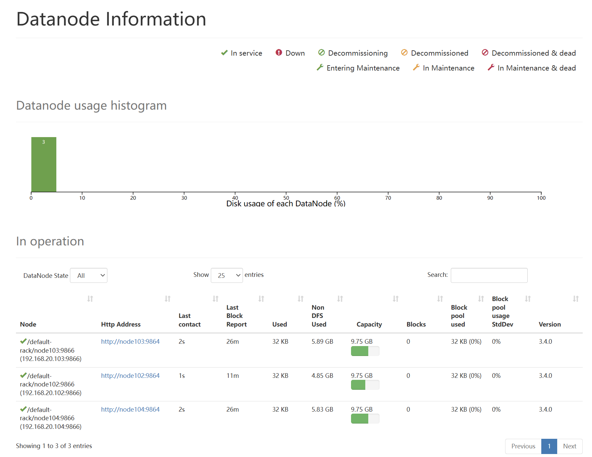
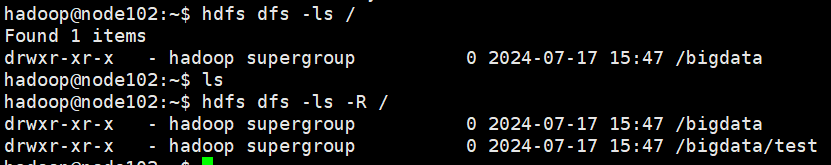
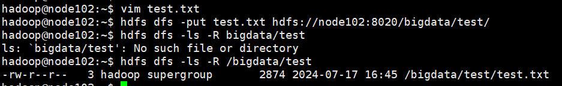
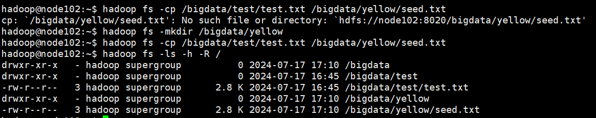
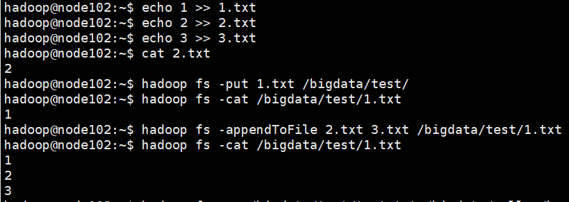
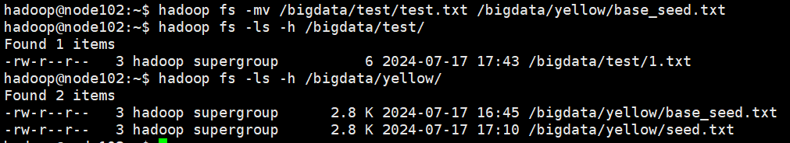

# HADOOP

## hadoop安装
配置文件位置 `hadoop/etc/hadoop`
### 配置文件
- 配置 `workers` 文件
  - 进入配置文件目录
    `cd etc/hadoop`
  - 编辑 `workers` 文件
    `vim workers`
  - 输入以下内容，要删掉 `localhost`
    ```
    node102
    node103
    node104
    ```
    
  
- 配置 `hadoop-env.sh` 文件
  ```
  export JAVA_HOME=/server/jdk/jdk1.8.0_411
  export HADOOP_HOME=/server/hadoop-3.4.0
  export HADOOP_CONF_DIR=$HADOOP_HOME/etc/hadoop
  export HADOOP_LOG_DIR=$HADOOP_HOME/logs
  ```
  
- 配置 `core-site.xml` 文件
  ```xml
  <configuration>
    <property>
      <name>fs.defaultFS</name>
      <value>hdfs://node102:8020</value>
    </property>
    <property>
      <name>io.file.buffer.size</name>
      <value>131072</value>
    </property>
  </configuration>
  ```
  
- 配置 `hdfs-site.xml`文件
  ```xml
  <configuration>
    <property>
      <name>dfs.datanode.data.dir.perm</name>
      <value>700</value>
    </property>
    <property>
      <name>dfs.namenode.name.dir</name>
      <value>/data/hadoop/nn</value>
    </property>
    <property>
      <name>dfs.namenode.hosts</name>
      <value>node102,node103,node104</value>
    </property>
    <property>
      <name>dfs.blockssize</name>
      <value>268435456</value>
    </property>
    <property>
      <name>dfs.namenode.handler.count</name>
      <value>100</value>
    </property>
    <property>
      <name>dfs.datanode.data.dir</name>
      <value>/data/hadoop/dn</value>
    </property>
  </configuration>
  ```
  + `dfs.datanode.dato.dir.perm`: hdfs文件系统，默认创建的文件权限设置
    值:700，即:rwx------
  + `dfs.namenodename.dir`:NameNode元数据的存储位置值:`/data/hadoop/nn`，在 `node102`节点的 `/data/hadoop/nn` 目录下
  + `dfs.namenode.hosts`:NameNode允许哪几个节点的DataNode连接(即允许加入集群)值: `node102`、`node103`、`node104`这三台服务器被授权
  + `dfs.blocksize` hdfs默认块大小
  值:268435456(256MB)
  + `dfs.namenode.handler.count` namenode处理的并发线程数值:100，以100个并行度处理文件系统的管理任务
  + `dfs.datanode.data.dir`：从节点DataNode的数据存储目录值:/data/dn，即数据存放在nodel、node2、node3，三台机器的/data/dn内

- 准备数据目录
  + 根据配置项创建目录
  + 在主节点
    ```
    sudo mkdir -p /data/hadoop/nn
    sudo mkdir /data/hadoop/dn
    ```
  + 在 `node103`、`node104`节点
    `sudo mkdir -p /data/hadoop/dn`
- 分发hadoop文件夹
  以上操作已经完成了hadoop的配置，可以把配置好的hadoop发往其他机器
  ```
  cd /server
  scp -r hadoop-3.4.0 node103:`pwd`/
  scp -r hadoop-3.4.0 node104:`pwd`/
  ```
### 配置环境变量
为了方便操作hadoop，把hadoop的脚本、程序配置到 `PATH` 中方便后续使用。
1. 编辑环境变量
```
# 在/etc/profile.d/my_env.sh里追加
# HADOOP_HOME
export HADOOP_HOME=/server/hadoop-3.4.0
export PATH=$PATH:$HADOOP_HOME/bin:$HADOOP_HOME/sbin
```
  刷新 `source /etc/profile`
2. 在其余节点配置同样的环境变/量

### 修改文件夹权限
#### 授权hadoop用户
为了确保安全，hadoop不以root用户启动，以普通用户启动，所以对文件权限进行授权。
以root身份在各个节点上执行如下命令
```
chown -R hadoop:hadoop /data
chown -R hadoop:hadoop /server/hadoop-3.4.0
```

### 格式化整个文件系统
#### 格式化 `namenode`
```
# 以hadoop用户执行
su hadoop
hadoop namenode -format
```
检查 `/data/hadoop/nn` 内有没有 `current` 文件，如果没有，根据日志找放到哪了，然后检查配置文件 `hdfs-site.xml`

#### 启动
- 一键启动hdfs集群
  `start-dfs.sh`
  
  
  
- 一键关闭hdfs集群
  `stop-dfs.sh`
  
  
> 起不起来检查配置，看看哪没写对

### 管理页面


在namenode的9870端口

```
node102:9870
http://192.168.20.102:9870
```
## hadoop的功能

## HDFS

### 一键启停
####  一键启动HDFS集群 `start-dfs.sh`
> $HADOOP_HOME/sbin/start-dfs.sh

执行原理
- 在执行此脚本的机器上启动 `SecondaryNameNode`
- 读取 `core-site.xml` 内容 (`fs.defaultFS`项)，确认 `NameNode` 所在的机器，启动 `NameNode`
- 读取 `workers` 内容，确定 `DataNode` 所在的机器，启动全部 `DataNode`
####  一键关闭HDFS集群 `stop-dfs.sh`
> $HADOOP_HOME/sbin/stop-dfs.sh

执行原理
- 在执行此脚本的机器上关闭 `SecondaryNameNode`
- 读取 `core-site.xml` 内容 (`fs.defaultFS`项)，确认 `NameNode` 所在的机器，关闭 `NameNode`
- 读取 `workers` 内容，确定 `DataNode` 所在的机器，关闭全部 `DataNode`

### 单进程启停
需要切换到所在的机器上执行才有效果
#### 单独控制所在机器的进程的启停(脚本)
`hadoop-daemon.sh (start|status|stop) (namenode|secondarynamenode|datanode)`
#### 单独控制所在机器的进程的启停(程序)
`hdfs --daemon (start|status|stop) (namenode|secondarynamenode|datanode)`

### 操作
#### 创建文件夹
- `hadoop fs -mkdir [-p] <path> ...`
- `hdfs dfs -mkdir [-p] <path> ...`
>`-p` 的选项与linux `mkdir -p` 一致
>`path` 为待创建的目录
```shell
# 这样是写本地
hadoop fs -mkdir -p file:///home/node102/test
# 这样是写hdfs
hadoop fs -mkdir -p hdfs://node102:8020/bigdata/test
```

#### 查看指定目录下的内容
- `hadoop fs -ls [-h] [-R] [<path> ...]`
- `hdfs dfs -ls [-h] [-R] [<path> ...]`
> `path` 指定目录路径
> `-h` 人性化显示文件size
> `-R` 递归查看指定目录及其子目录



#### 上传文件到HDFS指定目录下
- `hadoop fs -put [-f] [-p] <localsrc> ... <dst>`
- `hdfs dfs -put [-f] [-p] <localsrc> ... <dst>`
如果文件已经存在会提示 `put: 'xx.txt': File exists`
> `-f` 覆盖目标文件
> `-p` 保留访问和修改时间、所有权和权限
> `localsrc` linux文件路径
> `dst` hdfs路径 



#### 查看HDFS文件内容
- `hadoop fs -cat <src> ...`
- `hdfs dfs -cat <src> ...`
```shell
# 读取指定文件全部内容，显示在标准输出
hadoop fs -cat /bigdata/test/test.txt
```
读取大文件可以使用管道符配合 `more`
- `hadoop fs -cat <src> | more`
- `hdfs dfs -cat <src> | more`

#### 下载HDFS内容
- `hadoop fs -get [-f] [-p] <src> ... <localdst>`
- `hdfs dfs -get [-f] [-p] <src> ... <localdst>`
`hadoop fs -get /bigdata/test/test.txt .`

#### 拷贝HDFS文件
命令是HDFS对HDFS的复制
- `hadoop fs -cp [-f] <src> ... <dst>`
- `hdfs dfs -cp [-f] <src> ... <dst>`

`hadoop fs -cp /bigdata/test/test.txt /bigdata/yellow/seed.txt`
复制目的地的文件夹不存在会报错所以要提前创建


#### 追加数据到HDFS文件
将给定的本地文件的内容追加到给定的dst文件
想要修改文件，要么追加，要么删了修改重新上传
- `hadoop fs -appendToFile <localsrc> ... <dst>`
- `hdfs dfs -appendToFile <localsrc> ... <dst>`
> `dst` 如果dst文件不存在，将创建该文件
> `localsrc` 如果为-，则输入从标准输入中读取



#### HDFS数据移动操作

- `hadoop fs -mv <src> ... <dst>`
- `hdfs dfs -mv <src> ... <dst>`
  移动文件到指定文件夹下
  可以使用该命令移动数据，重命名文件的名称



#### HDFS数据删除操作
- `hadoop fs -rm -r [-skipTrash] URI [URI ...]`
- `hadoop fs -rm -r [-skipTrash] URI [URI ...]`
> 删除指定路径的文件或文件夹，指定 `-r` 删除文件夹
> `-skipTrash` 跳过回收站，直接删除

回收站功能默认关闭，如果需要开启需要在 `core-site.xml`内配置
```xml
<configuration>
  <property>
    <name>fs.trash.interval</name>
    <value>1440</value>
  </property>
  <property>
    <name>fs.trash.checkpoint.interval</name>
    <value>120</value>
  </property>
</configuration>
```
> 不需要重启集群，立即生效，在哪个机器配置的，在哪个机器执行命令就生效
> 回收站默认位置在 `/user/用户名hadoop/.trash`


## MapReduce
## YARN