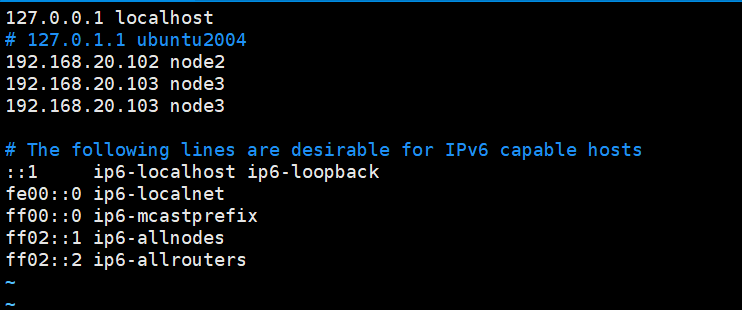
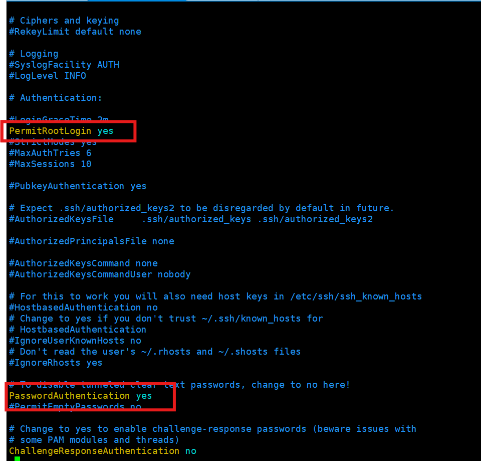

# ubuntu配置hadoop

## 配置网络
### 配置ip
编辑文件，在`17.xx`后就是这个文件管理网络配置，`/etc/interfaces`无效
在`/etc/netplan`下`xx-installer-config.yaml`
```
# This is the network config written by 'subiquity'
network:
  ethernets:
    ens33:
      dhcp4: no
      addresses: [192.168.20.102/24]
      gateway4: 192.168.20.2
      nameservers:
        addresses: [114.114.114.114,8.8.8.8]
  version: 2
```
刷新配置
`netplan apply`
查看服务状态
`networkctl status`
编辑文件`/etc/network/interfaces`
```
# static ip
auto ens33
iface ens33 inet static
address 192.168.20.102
netmask 255.255.255.0
gateway 192.168.20.2
dns-nameserver 8.8.8.8
dns-nameserver 8.8.4.4
dns-nameserver 192.168.20.102
```

### 修改主机名

#### 修改主机名

`vim /etc/hostname`这里改的是显示的名字


配置映射，hosts文件配置ip映射
```
192.168.20.102 node2
192.168.20.103 node3
192.168.20.103 node3
```
注释掉`127.0.0.`

效果是这样的



重启网络服务
`sudo systemctl restart systemd-networkd`

该服务名为`systemd-networkd`，而不是`networking`

### 配置ssh免密登录
- 在每一台机器都执行`ssh-keygen -t rsa -b 4096`
- 在每台机器上执行
``````
ssh-copy-id node102
ssh-copy-id node103
ssh-copy-id node104
``````
根据提示输入密码后可能出现报错 `Permission denied, please try again.`
解决方法如下

- 修改ssh配置文件

  `vim /etc/ssh/sshd_config`


- 重启服务
`/etc/init.d/ssh restart`

- 执行完毕后node2、node3、node4之间将完成root用户之间的免密互通


## 配置JDK

### 安装jdk

#### 下载

#### 解压
`tar -zxvf /home/hadoop/jdk-8u411-linux-x64.tar.gz -C /server`
#### 改名
统一安装到一个位置方便管理
`mv jdk1.8.0_411 jdk`

### 配置环境变量
```
# 环境变量
cd /etc/profile.d
# 创建自己的环境配置
vim my_env.sh
```

```
# JAVA HOME
export JAVA_HOME=/server/jdk/jdk1.8.0_411
export PATH=$PATH:$JAVA_HOME/bin
```
### java环境配置到每一台
#### `scp`拷贝
scp可以实现服务器到服务器之间的数据拷贝
```
scp -r $pdir/$fname $user@$host:$pdir/$fname
命令 递归 要拷贝的文件路径/文件名 目标用户@主机:目的地路径/文件名
```
例如`scp -r /server/jdk/jdk1.8.0_411 root@192.168.20.103:/server/jdk/jdk1.8.0_411`

## 关闭防火墙
使用 `ufw` 命令关闭防火墙
`sudo ufw disable`
### 设置时间/时区
查看服务器时间 `date`
```
date
Tue 16 Jul 2024 10:33:59 PM CST
```
查看时区列表 `timedatectl list-timezones`
  - 使用 `SPACE` 向下翻页
  - 使用 `b` 向上翻页
  - 按下 `q` 退出列表
更改时区，使用 `timedatectl set-timezone` 命令来设置时区
```
# 设置上海时区
sudo timedatectl set-timezone Asia/Shanghai
```
使用 `timedatectl` 查询 `timesyncd` 的状态
#### NTP服务器配置路径：`/etc/systemd/timesyncd.conf`
#### 切换到`ntpd`
首先需要关闭`temesyncd`，以免两个服务冲突
`sudo timedatectl set-ntp no`
检查输出是否为 `NTP service: inactive`。如果是意味 `timesyncd` 已经停止
之前
```
hadoop@node104:/server/hadoop-3.4.0$ timedatectl
               Local time: Tue 2024-07-16 06:18:53 UTC
           Universal time: Tue 2024-07-16 06:18:53 UTC
                 RTC time: Tue 2024-07-16 06:18:54    
                Time zone: Etc/UTC (UTC, +0000)       
System clock synchronized: yes                        
              NTP service: active                     
          RTC in local TZ: no    
```
之后
```
hadoop@node104:/server/hadoop-3.4.0$ timedatectl
               Local time: Tue 2024-07-16 06:51:55 UTC
           Universal time: Tue 2024-07-16 06:51:55 UTC
                 RTC time: Tue 2024-07-16 06:51:56    
                Time zone: Etc/UTC (UTC, +0000)       
System clock synchronized: yes                        
              NTP service: inactive                   
          RTC in local TZ: no  
```

运行 `apt update` 更新本地包索引
`sudo apt update`
安装ntp包
`sudo apt install ntp`