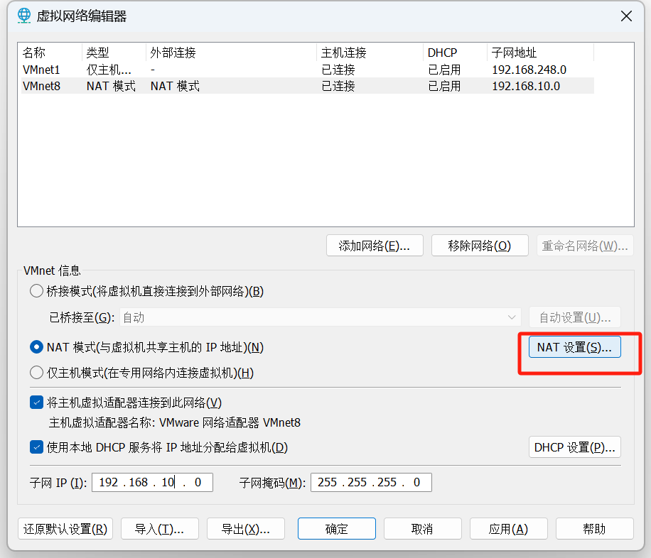

# vmware网络配置

1. 编辑
2. 编辑虚拟网络编辑器


## 编辑网络环境


### 设置网段和网关

子网ip设置为以下，避免192.168.10.x有占用，修改为192.168.xx.0，后面所有配置都要一同改
```
192.168.10.0
```


设置网关完成后点击 NAT设置



设置为192.168.10.2，网关和子网ip要同一个网段


### 配置windows网络

找到刚刚的net8


## 虚拟机网络配置
### 修改ip地址
修改网卡配置文件
```
vim /etc/sysconfig/network-scripts/ifcfg-ens33
```
修改BOOTPROTO配置

```
BOOTPROTO="static"
```

在后面加入一行，因为上面网段开始是 192.168.10.128，所以设置为131

```
IPADDR="192.168.10.101"
NETMASK="255.255.255.0"
GATEWAY="192.168.10.2"
DNS1="192.168.10.2"
```

### 设置主机名
改个名字，可以不是必须，好分辨，效果
```
hostnamectl set-hostname node1
```


### 配置主机名映射

#### 修改windows hosts

> C:\Windows\System32\drivers\etc\hosts

```
192.168.20.101 node1
192.168.20.102 node2
192.168.20.103 node3
```

#### 修改每台linux的hosts文件

> /etc/hosts

```
192.168.20.101 node1
192.168.20.102 node2
192.168.20.103 node3
```

